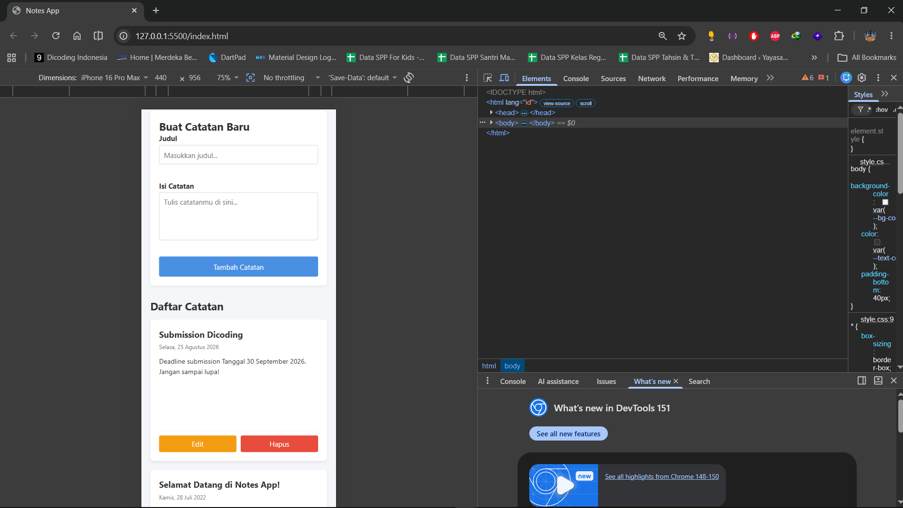
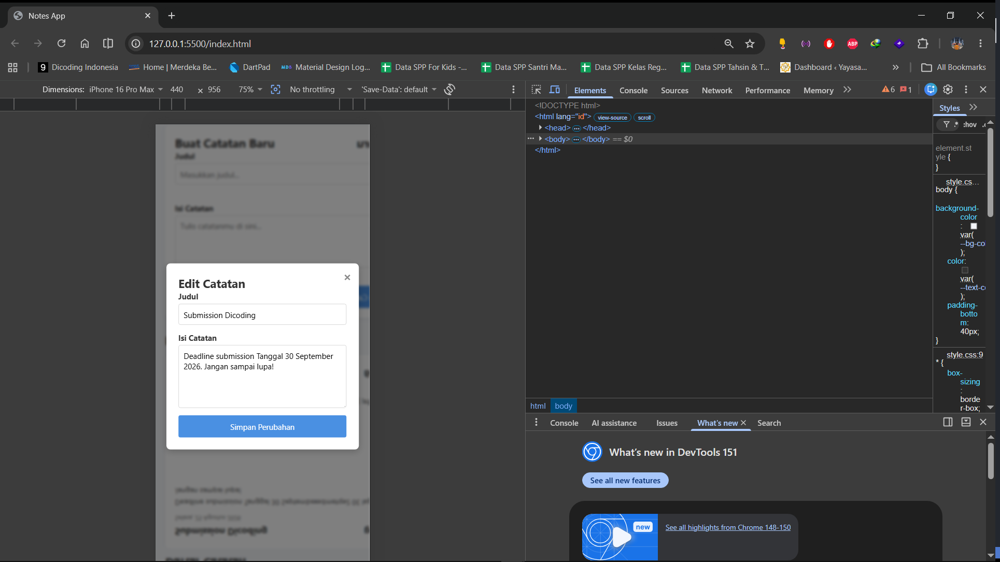
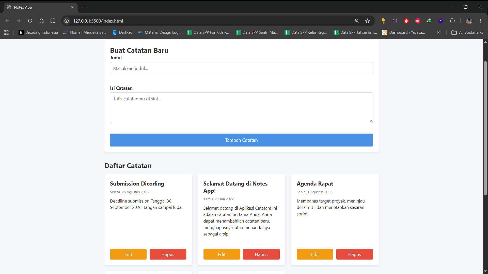
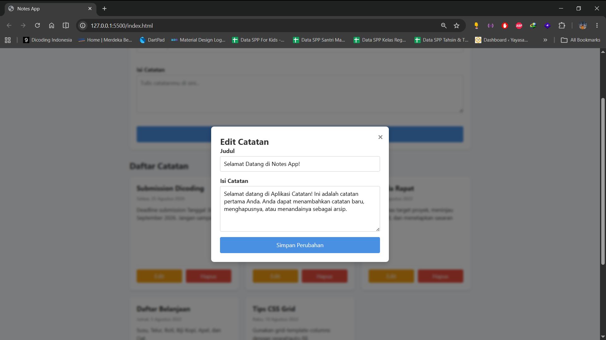

# 📝 Notes App - Web Component & CSS Grid

Aplikasi pencatatan sederhana yang dibangun menggunakan **Vanilla JavaScript**, **Web Components**, dan **CSS Grid**. Proyek ini dibuat untuk memenuhi kriteria submission Front-End Web Developer.

## 🚀 Fitur Utama

- **Menampilkan Catatan:** Menggunakan data bawaan dan integrasi `localStorage`.
- **Tambah & Edit Catatan:** Form input dengan realtime validation dan Modal Pop-up untuk pengeditan.
- **Hapus Catatan:** Menghapus data secara dinamis dari memori lokal.
- **Layout Responsif:** Menggunakan CSS Grid (`repeat(auto-fill, minmax(...))`) agar nyaman diakses dari berbagai ukuran layar.

## 📸 Tampilan Aplikasi

### Mobile Responsive View

### Edit Modal & Realtime Validation Mobile

### Desktop View

### Edit Modal & Realtime Validation Desktop

---

© 2026 Ananda Putra Nugraha.
